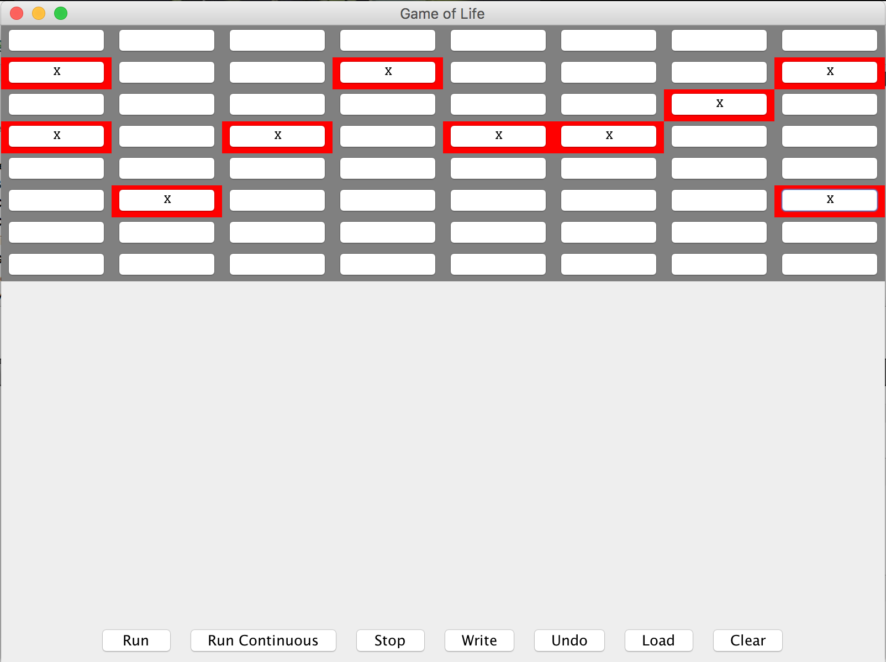
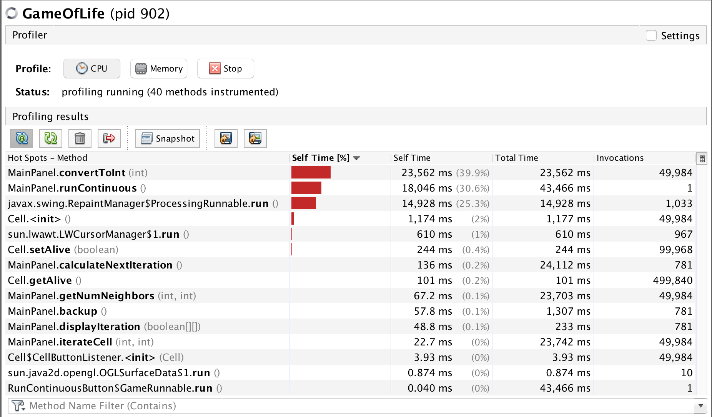
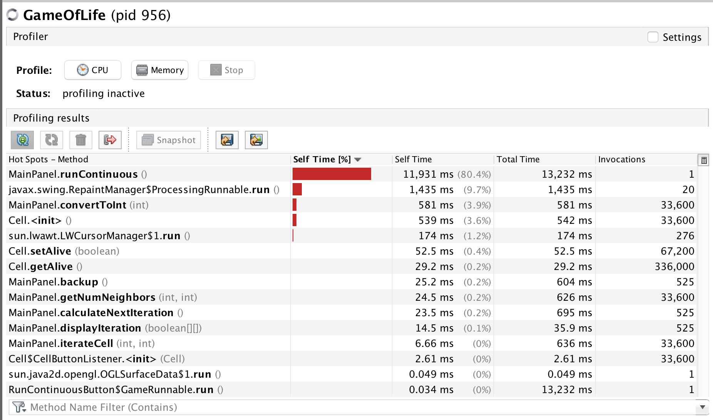

# SlowLifeGUI

> Panel Initial Status

<div style="text-align: center;">
	
</div>

> VisualVM Profiler indicated that top hotspot `MainPanel.convertToInt(int)` 

## Method 1: `MainPanel.convertToInt(int)`

<div style="text-align: center;">
	
</div>

### Initial status 

```java
  private int convertToInt(int x) {
    	int c = 0;
    	String padding = "0";
    	while (c < _r) {
    		String l = new String("0");
    		padding += l;
    		c++;
    	}
	
    	String n = padding + String.valueOf(x);
    	int q = Integer.parseInt(n);
    	return q;
    }
```

Original method above takes around 40% of CPU usage when running continuously. In original `convertToInt(int)` method, there is a while loop that create a new string "0" in each iteration and use `+` sign to append this new zero to padding. 

### Refactoring 

> Issue: in Java, `+` is not efficient to concatenate Strings in accumulative way, it is better to use `StringBuilder.append()` method.

**Modification**

```java
  private int convertToInt(int x) {
    	int c = 0;
    	StringBuilder padding = new StringBuilder("0"); // use `StringBuilder` instead of `new String()`
    	while (c < _r) {
    		padding.append("0");
    		c++;
    	}
    	
    	String n = padding.toString() + String.valueOf(x); // continue use String 
    	int q = Integer.parseInt(n);
    	return q;
    }
```

> Spinning Result 

<div style="text-align: center;">
	
</div>

## Method2: `MainPanel.runContinuous()`

> After I improved the performance of `MainPanel.convertToInt(int)`, the profiling result shows that the next problem is `MainPanel.runContinuous()`

### Initial status

``` java
 public void runContinuous() {
        _running = true;
        while (_running) {
            System.out.println("Running...");
  
            int origR = _r;
 
            try {
                Thread.sleep(20);
            } catch (InterruptedException iex) { }

            
            for (int j=0; j < _maxCount; j++) {
                _r += (j % _size) % _maxCount;
                _r += _maxCount;
            }
            _r = origR;
            
            backup();
            calculateNextIteration();
        }
    }
```

### Refactoring

After I review the code, I found the part of code in the method did not performing any role in the execution. It is just updating `_r` and set thread to rest, but later on the `_r` are converted back to the original varibale. And since it put the thread to sleep it slows the whole process and consumes much CPU usage. So I commented out the unnecessary code. The method after refactoring looks like:

```java
     public void runContinuous() {
        _running = true;
        while (_running) {
            System.out.println("Running...");
            /**
            int origR = _r;
 
            try {
                Thread.sleep(20);
            } catch (InterruptedException iex) { }

            
            for (int j=0; j < _maxCount; j++) {
                _r += (j % _size) % _maxCount;
                _r += _maxCount;
            }
            _r = origR;
            */
            backup();
            calculateNextIteration();
        }
    }
```


### Refactoring Performance compare

> Before refactoring

<div style="text-align: center;">
    
</div>

> After refactoring 

<div style="text-align: center;">
    
</div>

### Pining Test

## Method 3: `MainPanel.getNumNeighbors(int x, int y)`

### Initial Status

```java 
    public int getNumNeighbors(int x, int y) {
        int size = _size;
        int leftX = (x - 1) % size;
        int rightX = (x + 1) % size;
        int upY = (y - 1) % size;
        int downY = (y + 1) % size;

        if (leftX == -1) { leftX = size - 1; }
        if (rightX == -1) { rightX = size - 1; }
        if (upY == -1) { upY = size - 1; }
        if (downY == -1) { downY = size - 1; }
        
        int numNeighbors = 0;

        if (_cells[leftX][upY].getAlive())    { numNeighbors++; }
        if (_cells[leftX][downY].getAlive())  { numNeighbors++; }
        if (_cells[leftX][y].getAlive())      { numNeighbors++; }
        if (_cells[rightX][upY].getAlive())   { numNeighbors++; }
        if (_cells[rightX][downY].getAlive()) { numNeighbors++; }
        if (_cells[rightX][y].getAlive())     { numNeighbors++; }
        if (_cells[x][upY].getAlive())        { numNeighbors++; }
        if (_cells[x][downY].getAlive())      { numNeighbors++; }
        
        return convertToInt(numNeighbors);
    }
```


### Refactoring

After I refactored run continously, I find the profiling indicate that `MainPanel.convertToInt(int)` is again becoming the top CPU comsumer in the program. I wondered the reason and after checking the code I found method `MainPanel.getNumNeighbors(int x, int y)` calls `convertToInt(int)` in the return statement. After I check the code, I found this call is actually unnecessary since the variable `numNeighbors` is already a `int` type, there is no need to use another method to convert to int. So, instead of using `convertToInt(int)` method in return statement, it can simplily return `numNeighbors` directly. 

```java

    public int getNumNeighbors(int x, int y) {
        int size = _size;
        int leftX = (x - 1) % size;
        int rightX = (x + 1) % size;
        int upY = (y - 1) % size;
        int downY = (y + 1) % size;

        if (leftX == -1) { leftX = size - 1; }
        if (rightX == -1) { rightX = size - 1; }
        if (upY == -1) { upY = size - 1; }
        if (downY == -1) { downY = size - 1; }
        
        int numNeighbors = 0;

        if (_cells[leftX][upY].getAlive())    { numNeighbors++; }
        if (_cells[leftX][downY].getAlive())  { numNeighbors++; }
        if (_cells[leftX][y].getAlive())      { numNeighbors++; }
        if (_cells[rightX][upY].getAlive())   { numNeighbors++; }
        if (_cells[rightX][downY].getAlive()) { numNeighbors++; }
        if (_cells[rightX][y].getAlive())     { numNeighbors++; }
        if (_cells[x][upY].getAlive())        { numNeighbors++; }
        if (_cells[x][downY].getAlive())      { numNeighbors++; }
        
        return numNeighbors; // changes here 
    }
```


### Refactoring Performance Compare

> Before refactoring

<div style="text-align: center;" >
    
</div>

New Result shows that under same initial board the CPU usage of `MainPanel.convertToInt(int)` method is greatly diminished, from 40% (previous) to 3.9% (current). Which gives justification for this modification. 

> After refactoring 

<div style="text-align: center;" >
    
</div>


